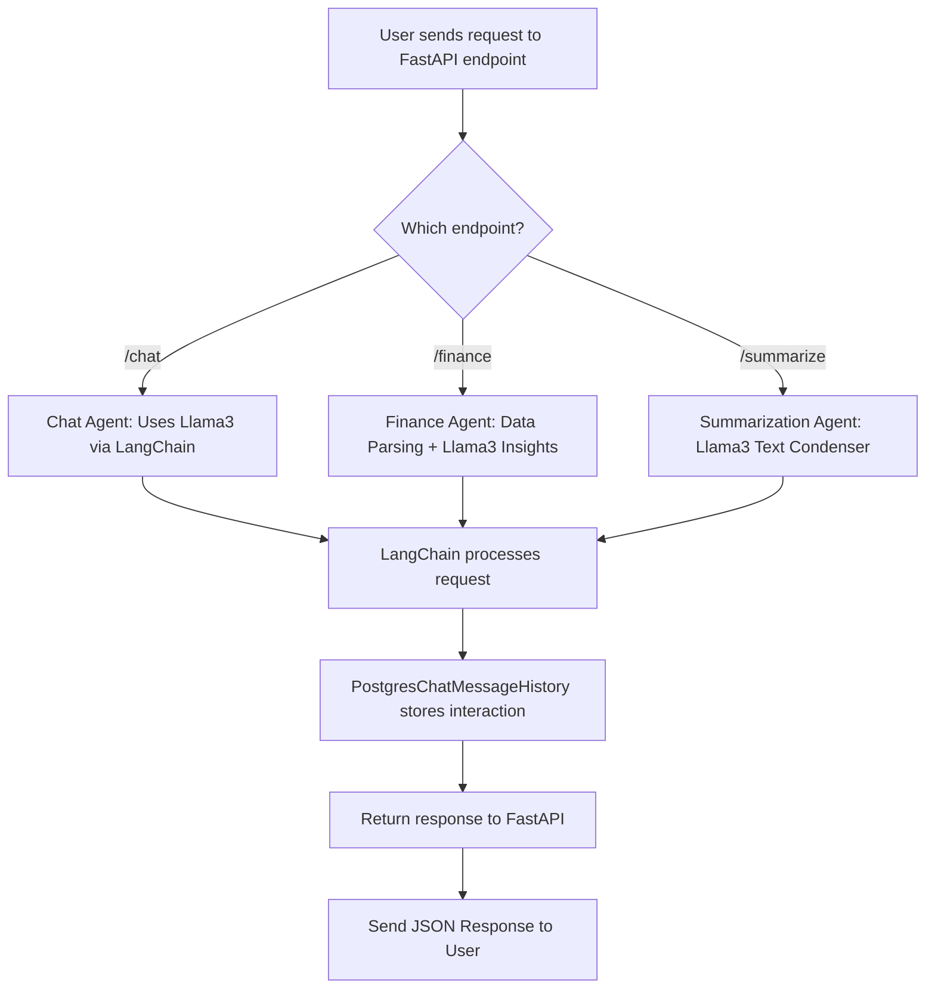

# 🧠 Multi-Agent AI with FastAPI + LangChain + Ollama (Llama3)

This project is a **FastAPI-powered AI Agent API** that lets users interact with different AI agents for various tasks, all powered by the **Ollama Llama3** model through **LangChain**.

## 🚀 Features
- **Chat Agent** — General-purpose conversational AI.
- **Finance Agent** — Parses financial inputs and provides AI-driven insights.
- **Summarization Agent** — Condenses long text into short, clear summaries.
- **Postgres Integration** — Stores chat history using `PostgresChatMessageHistory`.
- **Multiple Endpoints** — `/chat`, `/finance`, `/summarize`.

✅ **All agents currently use the Llama3 model for AI responses.**

---

## 🧩 User Flow Diagram

##📦 Installation
- git clone https://github.com/yourusername/multi_agent_ai.git
- cd multi_agent_ai
- python -m venv env
- source env/bin/activate   # On Windows use: env\Scripts\activate
- pip install -r requirements.txt

- uvicorn app.main:app --reload

## Endpoints
| Method | Endpoint     | Description                        |
| ------ | ------------ | ---------------------------------- |
| POST   | `/chat`      | General conversation with AI Agent |
| POST   | `/finance`   | AI-driven financial insights       |
| POST   | `/summarize` | Summarize long text                |

