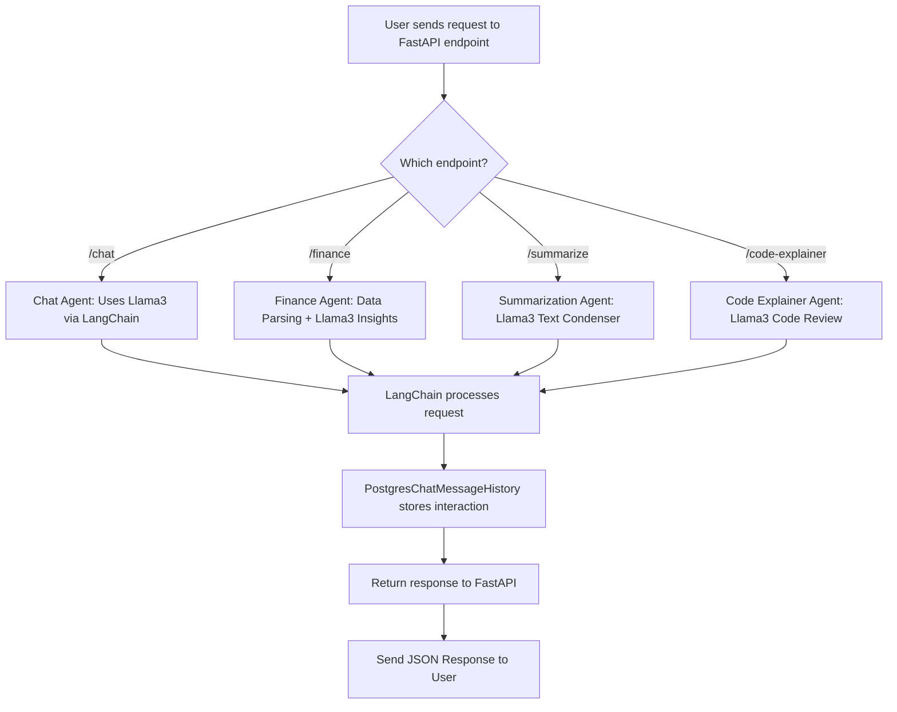

# Multi-Agent AI with FastAPI + LangChain + Ollama (Llama3)

This project is a **FastAPI-powered AI Agent API** that lets users interact with different AI agents for various tasks, all powered by the **Ollama Llama3** model through **LangChain**.

## Features

* **Chat Agent** — General-purpose conversational AI.
* **Finance Agent** — Parses financial inputs and provides AI-driven insights.
* **Summarization Agent** — Condenses long text into short, clear summaries.
* **Code Explainer Agent** — Explains, reviews, and suggests improvements for code snippets.
* **Postgres Integration** — Stores chat history using `PostgresChatMessageHistory`.
* **Multiple Endpoints** — `/chat`, `/finance`, `/summarize`, `/code-explainer`.

✅ **All agents currently use the Llama3 model for AI responses.**

---

## 🧩 User Flow Diagram



---

## Installation

```bash
# clone
git clone https://github.com/yourusername/multi_agent_ai.git
cd multi_agent_ai

# virtualenv (unix/mac)
python -m venv env
source env/bin/activate

# on Windows
# python -m venv env
# env\Scripts\activate

pip install -r requirements.txt
```

Run the server:

```bash
#uvicorn app.main:app --reload
uvicorn multi_agent_ai.main:app --reload
```

---

## Endpoints

| Method | Endpoint          | Description                        |
| ------ | ----------------- | ---------------------------------- |
| POST   | `/chat`           | General conversation with AI Agent |
| POST   | `/finance`        | AI-driven financial insights       |
| POST   | `/summarize`      | Summarize long text                |
| POST   | `/code-explainer` | Explain and review code snippets   |

---

## Quick Usage Examples

### Chat

```bash
curl -X POST "http://127.0.0.1:8000/chat" -H "Content-Type: application/json" -d '{"message":"Hello AI, tell me a joke"}'
```

### Finance

```bash
curl -X POST "http://127.0.0.1:8000/finance" -H "Content-Type: application/json" -d '{"data":"Uber - 3500, Grocery - 15000, Electricity - 12000"}'
```

### Summarize

```bash
curl -X POST "http://127.0.0.1:8000/summarize" -H "Content-Type: application/json" -d '{"text":"Long article text here..."}'
```

### Code Explainer

```bash
curl -X POST "http://127.0.0.1:8000/code-explainer" -H "Content-Type: application/json" -d '{"code":"def add(a,b): return a + b"}'
```

---

## Notes

* Ensure **Ollama** is installed and the **Llama3** model is pulled locally:

```bash
ollama pull llama3
ollama run llama3
```

* In Docker, use `host.docker.internal` or `--add-host=host.docker.internal:host-gateway` on Linux so the container can reach your Ollama host.
* If you add the `/route` router (free-form routing agent), it can decide between these agents automatically based on user input.


*url for the swagger docs and endpoints to test it
- https://ai-agent-llama3-ollama-langchain-production.up.railway.app/docs
---


